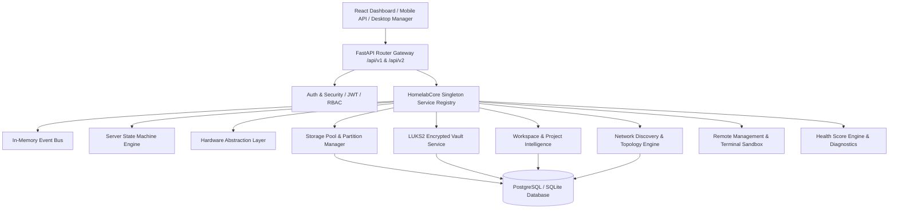

# HomeLab OS v1.0.0 — Final Architecture Specification

## Executive Overview
HomeLab OS v1.0.0 is an open-source, modular, event-driven personal server platform built entirely in **Python (FastAPI)** and **React**.

---

## 🏛️ System Layering & Component Architecture

---

## 🔑 Core Services Summary
- **HomelabCore**: Central service registry singleton managing service initialization and lifecycles.
- **EventBus**: Async pub/sub event dispatcher supporting typed event topics across all services.
- **StateEngine**: System state transition engine (`BOOTING`, `RUNNING`, `MAINTENANCE`, `EMERGENCY_RECOVERY`, `SHUTTING_DOWN`).
- **HAL Layer**: Hardware query layer dynamically reading host metrics (CPU, RAM, Temp, Network) across Linux, Windows, and macOS.
- **Storage & Vault**: Partition mounting/unmounting, SMART health checks, and Sparse LUKS encrypted vault container management.
- **Network Engine**: LAN discovery via ARP, mDNS, SSDP, DHCP inspection, topology graph generation, and device alert rules.
