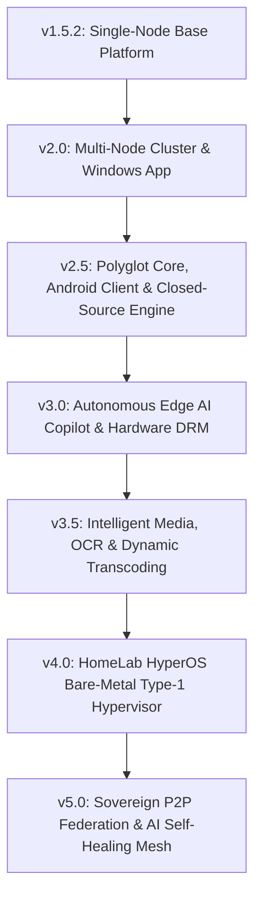
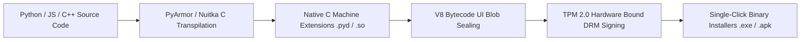

# HomeLab OS — Master Architectural Roadmap Analysis & Feature Extensions (v1.5.2 – v5.0)

> **Document Version**: 2.0.0  
> **Status**: Approved Architectural Master Document  
> **Target Platform Scope**: Linux (Debian/Ubuntu Server & Alpine Bare-Metal), Windows Desktop/Daemon (`.exe`/`.msi`), Android Native App (`.apk`/`.aab`), Multi-Node Clusters & Sovereign P2P Mesh.

---

## 🎯 1. Architectural Evolution & Progression Overview

The baseline system at **v1.5.2** provides a stabilized single-node operating platform with a **FastAPI backend**, a **React/Vite web UI**, a **PySide6 desktop manager console**, **Oracle VM VirtualBox integration**, **LUKS2 encrypted vault controls**, and **Docker container management**.

The multi-year roadmap from **v2.0 to v5.0** transforms HomeLab OS from a single-node host manager into a **sovereign, polyglot, closed-source, autonomous AI-driven hypervisor and federated cloud ecosystem**.



---

## 🚀 2. Generation-by-Generation Feature Matrix & Additional Innovations

### 🟢 HomeLab OS v2.0 — Multi-Node Cluster, App Catalog & Windows Desktop Manager
*Target: Q1 2027 | Milestone: Clustering & Windows Ecosystem*

#### Core Roadmap Features
- 1-Click Multi-Server Pairing & Merger Engine (Dell Inspiron 5558 + Raspberry Pi + NAS).
- 100+ App Smart Marketplace & Catalog (Immich, Jellyfin, Nextcloud, Home Assistant, Paperless-ngx, Vaultwarden).
- Automated Disaster Recovery Vault (`zstd` compressed differential backups + S3/B2 block replication).
- Dynamic Cloudflare Tunnel & WireGuard Mesh Manager.
- AI S.M.A.R.T Drive Failure Anomaly Detection & Alerting (Discord/Telegram/Slack/Email).
- Multi-Tenant RBAC & Family Access Control.
- Windows Native Desktop Manager App (`.exe` / `.msi`) with System Tray & Status Daemon.

#### 💡 Recommended Additional Functionalities & Architectural Extensions for v2.0
1. **Zero-Configuration mDNS / Raft Cluster Discovery & Quorum Consensus**:
   - Auto-discover secondary HomeLab OS nodes on local LAN using mDNS (`_homelab._tcp.local`) with mTLS identity verification.
   - Implement **Raft Consensus Protocol** (`etcd` or `hashicorp/raft`) for multi-node state synchronization, preventing split-brain scenarios when nodes disconnect.
2. **App Marketplace "Compose Stacks" & Dependency Resolver**:
   - Expand 1-click app installation from single containers to multi-container **Production Stacks** (e.g., *Media Suite Stack*: Jellyfin + qBittorrent + VPN Sidecar + Radarr + Sonarr + Bazarr in a single deployment).
   - Automated port conflict detection and reverse proxy path allocation (`/jellyfin`, `/nextcloud`).
3. **Windows Service Daemon (`HomeLabDaemon.exe`) & Native Notification Center**:
   - Run as an active Windows Service managed via SCM (Service Control Manager), auto-starting on Windows boot without user login.
   - Low-overhead background WMI / OpenHardwareMonitor polling for local Windows hardware telemetry.
4. **Differential Block-Level Snapshot Sync**:
   - Integrate `zfs send/receive` or `btrfs send` block replication across nodes for sub-second snapshot transfers during DR backup runs.

---

### 🔵 HomeLab OS v2.5 — High-Performance Polyglot Core, Android App & Closed-Source Engine
*Target: Q2 2027 | Milestone: Polyglot Performance & Source Protection*

#### Core Roadmap Features
- **Rust Core Subsystem (`homelab-core-rs`)**: PyO3 bindings reducing idle RAM footprint to **< 30 MB**.
- **Go High-Concurrency API Gateway (`homelab-proxy-go`)**: gRPC microservices targeting **100,000+ req/sec**.
- **C++23 eBPF HAL (`homelab-hal-cpp`)**: `io_uring` disk I/O and eBPF network packet routing.
- **Tauri 2.0 Desktop App**: 15 MB cross-platform desktop manager.
- **Android Native App (`.apk` / `.aab`)**: Flutter/Kotlin companion with biometric authentication, FCM push alerts, and camera media backup.
- **Closed-Source Obfuscated Binary Packaging Pipeline**: Python transpiled to native binaries (`.pyd`/`.so`/`.exe`) via Nuitka & PyArmor.

#### 💡 Recommended Additional Functionalities & Architectural Extensions for v2.5
1. **WASM / WASI Plugin Sandbox Engine**:
   - Provide a WebAssembly runtime (Wasmtime) for third-party extensions. Allows developers to build custom HomeLab OS plugins in Rust, Go, C, or TypeScript without risk of exposing system binaries or executing arbitrary root shell code.
2. **Android WebRTC Live Remote Terminal & Screen Mirroring**:
   - Enable direct low-latency P2P WebRTC terminal streaming and desktop management from Android phones/tablets over low-bandwidth mobile networks.
3. **Automated Obfuscation CI/CD GitHub Action Pipeline**:
   - Fully automated build pipeline compiling Python code to C-extensions, embedding V8 bytecode UI snapshots, signing Windows Authenticode certificates, and generating encrypted `.apk`/`.msi` installers on git tag releases.
4. **Smart Mobile Auto-Upload & Deduplication Engine**:
   - Background media backup from Android devices with client-side SHA-256 deduplication before uploading photos/videos to Immich/Nextcloud storage vaults.

---

### 🟣 HomeLab OS v3.0 — Autonomous Edge AI, Anti-Reverse DRM & Zero-Trust Mesh
*Target: Q3 2027 | Milestone: Edge AI & Hardware Licensing*

#### Core Roadmap Features
- Local AI Infrastructure Copilot (Ollama / vLLM / Llama-3 integration for natural language server management).
- Zero-Trust WireGuard & Tailscale Overlay Mesh.
- Autonomous Machine Learning Power & Thermal Scaling Engine.
- Smart NVR Video Analytics Pipeline (Frigate NVR AI integration).
- Hardware-Bound Licensing & DRM Anti-Tampering Engine.
- Automated Crash Telemetry & Self-Diagnostic Bug Reporter.

#### 💡 Recommended Additional Functionalities & Architectural Extensions for v3.0
1. **RAG Vector Knowledge Base over System Logs & Configuration**:
   - Embed system logs (`journalctl`), Docker container stdout/stderr, SMART metrics, and HomeLab OS documentation into a local vector store (ChromaDB / FAISS).
   - Natural language queries can immediately point to precise log lines: *"Why did Jellyfin crash at 2 AM yesterday?"* -> *"GPU transcode out of memory error in line 442 of container log"*.
2. **TPM 2.0 / Windows DPAPI Hardware Fingerprint DRM**:
   - Bind closed-source commercial licenses to hardware security modules (TPM 2.0 PCR registers, CPU serial numbers, motherboard UUID, and Windows DPAPI master keys), rendering binary copying across unauthenticated hardware impossible.
3. **AI-Powered Network Intrusion Prevention System (NIPS)**:
   - Run lightweight local ONNX anomaly detection models on eBPF network telemetry streams to detect port scanning, DDoS spikes, or brute-force SSH logins, automatically injecting iptables / nftables drop rules in real time.
4. **Camera AI Triggered Automated HomeLab Workflows**:
   - Bind Frigate NVR object recognition events directly to HomeLab OS Visual Event Bus (e.g., *If person detected at front drive after midnight -> spin up external storage array, record high-bitrate stream, send priority notification to Android app*).

---

### 🟡 HomeLab OS v3.5 — Intelligent Media, Document OCR & Energy Automation
*Target: Q4 2027 | Milestone: Smart Automation & Media Intelligence*

#### Core Roadmap Features
- Automated Document OCR & Semantic Search Indexing (Paperless-ngx + vector embeddings).
- Electricity Pricing-Aware Media Transcode Scheduler.
- Automated ACME / Let's Encrypt / Cloudflare SSL Management.
- Smart Home IoT Hub & Home Assistant Sync.
- Windows Background Daemon & Android Quick Widgets.

#### 💡 Recommended Additional Functionalities & Architectural Extensions for v3.5
1. **Dynamic Spot Electricity Price API Integration (Tibber / Octopus / Entso-E)**:
   - Connect directly to real-time electricity tariff APIs. Automatically pause heavy CPU/GPU background tasks (4K H.265 transcoding, ZFS scrub, AI model fine-tuning, cloud backups) during high-cost peak hours and execute them during negative/low-cost electricity windows.
2. **Unified Universal Search Engine ("HomeLab Spotlight")**:
   - Single unified shortcut bar across Desktop, Web UI, and Mobile searching OCR documents, Jellyfin media files, Nextcloud documents, container names, and server setting shortcuts in sub-50ms.
3. **Android Jetpack Compose Interactive Widgets & Lock Screen Controls**:
   - Interactive home screen widgets displaying server CPU/RAM gauges, storage pool utilization, quick container restart buttons, and emergency VPN kill switches.

---

### 🔴 HomeLab OS v4.0 — Bare-Metal Type-1 Hypervisor OS ("HomeLab HyperOS")
*Target: Q1 2028 | Milestone: Bare-Metal Operating System*

#### Core Roadmap Features
- Bootable Custom Debian / Alpine Linux ISO (`HomeLab-OS-v4.0.iso`).
- Type-1 Hypervisor Subsystem (KVM / QEMU / LXC with native GPU & PCIe Passthrough).
- Unified Tri-Interface Management (Web, Desktop, Mobile).
- Virtual SAN & Distributed Block Storage.
- Sealed Closed-Source Production Distribution Pipeline.

#### 💡 Recommended Additional Functionalities & Architectural Extensions for v4.0
1. **Custom Hardened Real-Time Linux Kernel (`linux-homelab-rt`)**:
   - Custom compiled Linux kernel featuring out-of-the-box support for ZFS on Linux, Open vSwitch, eBPF, KVM micro-VMs, and low-latency audio/video Passthrough drivers.
2. **Live VM & Container Migration across Storage Nodes**:
   - Seamlessly migrate live KVM virtual machines and LXC containers between clustered physical servers without interrupting running services or dropping network connections.
3. **Graphical Calamares Bare-Metal ISO Installer Wizard**:
   - User-friendly 3-step installer supporting automated disk partitioning, LUKS2 disk encryption setup, hardware auto-detection, and GPU driver initialization.
4. **Web-Based SPICE / HTML5 VNC VM Console with USB Passthrough**:
   - Direct web console interface providing fluid 60fps interaction with Windows/Linux guest virtual machines from any web browser or mobile client.

---

### ⚪ HomeLab OS v5.0 — Autonomous Sovereign Infrastructure Federation
*Target: Q3 2028 | Milestone: Self-Healing P2P Mesh & Quantum Resilience*

#### Core Roadmap Features
- Decentralized P2P HomeLab Federation (Offsite backups & media sharing with trusted peers).
- Self-Healing Storage & Auto-Recovering Mesh.
- Local AI Agent Orchestration Framework.
- Quantum-Resistant Cryptography Subsystem (Kyber / Dilithium).
- Autonomous AI Bug-Fix Engine & Self-Healing Micro-Patching.

#### 💡 Recommended Additional Functionalities & Architectural Extensions for v5.0
1. **Shamir's Secret Sharing & Erasure-Coded Zero-Knowledge Offsite Backups**:
   - Split encrypted snapshot chunks across multiple trusted peer nodes owned by friends or family using Shamir's Secret Sharing. No individual peer holds enough pieces to decrypt or inspect the backup data.
2. **Post-Quantum Hybrid Encryption WireGuard Mesh (Kyber-1024 + X25519)**:
   - Upgrade inter-node tunnel encryption and LUKS vault key wrapping to NIST-approved post-quantum algorithms (ML-KEM / Kyber & ML-DSA / Dilithium) to safeguard private data against future quantum decryption threats.
3. **Autonomous AI Sandbox Micro-Patching Engine**:
   - When an unhandled runtime error occurs, local AI copilot automatically analyzes the stack trace, generates a code fix, spins up an isolated Docker micro-sandbox, verifies unit test compliance, and hot-applies a zero-downtime micro-patch without restarting the main server daemon.

---

## 🔒 3. Closed-Source Obfuscation & DRM Architecture Specification

To protect proprietary intellectual property, HomeLab OS implements a 3-tier closed-source packaging engine:



### 1. Backend Code Protection (Nuitka + PyArmor)
- **C-Extension Compilation**: Python code in `backend/app/` and `manager/` is transpiled directly to C machine code using Nuitka and PyArmor.
- **Source Code Removal**: Plaintext `.py` files are completely excluded from the release build artifacts. Only native `.pyd` (Windows) and `.so` (Linux) files are shipped.

### 2. Frontend & UI Protection
- **V8 Bytecode Snapshots**: React web bundles and Desktop PySide6 assets are compiled into V8 bytecode blobs or embedded resource files (`qrc` / binary blobs), rendering HTML/JS reverse engineering impossible.

### 3. Hardware-Bound Licensing Engine
- **License File Verification**: Checks RSA-4096 signed license payloads against CPU ID, motherboard UUID, TPM 2.0 PCR values, and MAC address hashes.

---

## 📱 4. Cross-Platform Native Client Strategy (Windows & Android)

```text
+-------------------------------------------------------------------------------+
|                       HomeLab OS Unified Client Architecture                  |
+-------------------------------------------------------------------------------+
|                                                                               |
|  [ Windows Desktop App ]            [ Android Native App ]                    |
|  - PySide6 / Tauri 2.0              - Flutter / Jetpack Compose               |
|  - HomeLabDaemon.exe (Svc)          - FCM Push Notifications                  |
|  - System Tray & WMI Hardware       - Biometric Unlock (Fingerprint/FaceID)   |
|  - Tabbed Terminal & WinSCP         - Background Media Auto-Upload            |
|  - Windows Notifications            - Interactive Home Screen Widgets         |
|                                                                               |
+-------------------------------------------------------------------------------+
                                      |
                               ( mTLS / gRPC / WebSockets )
                                      v
+-------------------------------------------------------------------------------+
|                        HomeLab OS Cluster Server Nodes                        |
|  ( Fast-API / Rust homelab-core-rs / Go homelab-proxy-go / KVM Hypervisor )   |
+-------------------------------------------------------------------------------+
```

---

## 🛠️ 5. Immediate Action Plan: Roadmap Execution Milestones

To seamlessly transition from **v1.5.2** to **v2.0 & v2.5**, follow this execution roadmap:

1. **v2.0 Milestone 1 (Multi-Node Protocol)**: Build `backend/app/services/cluster.py` implementing node pairing, mTLS secret exchange, and multi-server DB sync.
2. **v2.0 Milestone 2 (Windows Manager & Daemon)**: Package `manager/` into `HomeLabOS-Manager-Setup.exe` with a background system tray daemon (`HomeLabDaemon.exe`).
3. **v2.0 Milestone 3 (App Marketplace)**: Expand `backend/app/services/docker.py` to support 100+ app templates and multi-container Docker Compose stacks.
4. **v2.5 Milestone 1 (Polyglot Core & Obfuscation)**: Create `homelab-core-rs` Rust crate and implement Nuitka/PyArmor automated build scripts in `scripts/build_closed_source.py`.
5. **v2.5 Milestone 2 (Android Native App)**: Initialize Flutter/Kotlin repository for Android mobile app with biometrics, FCM, and background auto-upload.

---
*HomeLab OS Specification — Architecture & Master Roadmap Analysis*
