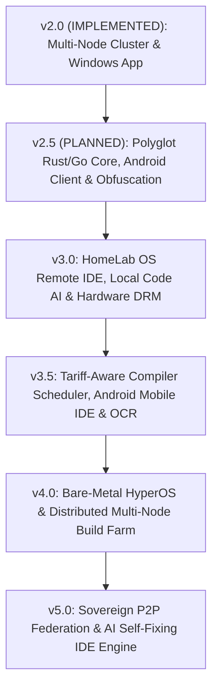

# HomeLab OS — Master Architectural Roadmap & Future Generation Specifications (v2.0 Implemented | v3.0 – v5.0 Focus)

> **Document Version**: 3.0.0  
> **Status**: Approved Master Roadmap & Product Extension Architecture  
> **Special Module Focus**: **HomeLab OS IDE (Remote Compiler & Distributed Cloud IDE Ecosystem)**

---

## 🎯 1. Master Architectural Progression (v2.0 Implemented ➡️ v3.0 – v5.0 Evolution)

With **v2.0 (Multi-Node Cluster & Windows Desktop App)** active, and **v2.5 (Polyglot Core & Closed-Source Obfuscation)** maintained as planned, the roadmap focuses on **v3.0, v3.5, v4.0, and v5.0**.

A flagship addition in **v3.0** is the **HomeLab OS IDE** — a native remote compiler and cloud IDE subsystem enabling secure remote code editing, PTY terminal access, containerized build execution, and GPU-accelerated compilation offloading from any Windows PC, Android tablet/phone, or Web browser.



---

## 💻 2. HomeLab OS IDE — Remote Compiler & Cloud IDE Architecture

### Architectural Overview
**HomeLab OS IDE** decouples code editing from code compilation and execution:
- **Client Tier (Web Browser, Windows Desktop, Android Mobile/Tablet)**: Lightweight UI editor (Monaco Editor / VS Code Web core), interactive PTY terminal widget (`xterm.js`), and project file tree.
- **Server Tier (`homelab-ide-daemon`)**: High-performance backend service running on server hardware, managing ephemeral Docker compiler sandboxes, PTY WebSocket terminals, file watchers, and gRPC language server protocol (LSP) proxies.

```text
+---------------------------------------------------------------------------------+
|                           HomeLab OS IDE Client Tier                            |
|                                                                                 |
|  [ Web Browser IDE ]        [ Native Windows IDE ]     [ Android Native Mobile ]|
|  - Monaco / VS Web          - PySide6 / Tauri 2.0      - Flutter / Compose      |
|  - xterm.js PTY Shell       - Multi-Terminal Tabs      - Floating Hotkeys       |
|  - Visual Debugger          - Local/Remote Sync        - Touch Code Editor      |
+---------------------------------------------------------------------------------+
                                       |
                         ( WebSocket / mTLS / gRPC / WebRTC )
                                       v
+---------------------------------------------------------------------------------+
|                       HomeLab OS Server Remote Build Engine                     |
|                                                                                 |
|  - HomeLab IDE Daemon (File Watcher, PTY Master, LSP Router)                    |
|  - Ephemeral Container Build Sandboxes (GCC/Clang, Cargo/Rust, Go, Python, CUDA)|
|  - Server Hardware Offload (Intel QuickSync / NVIDIA CUDA GPU / 32-Core CPU)    |
|  - Local AI Code Copilot (Ollama / DeepSeek-Coder / Llama-3-Code)               |
+---------------------------------------------------------------------------------+
```

---

## 🚀 3. Groundbreaking Features & Innovations for HomeLab OS IDE

### 1. Isolated Ephemeral Compiler Sandboxes ("Zero-Pollution Builds")
- Every compile request or terminal session runs inside a isolated Docker/LXC container pre-configured with project SDKs (e.g. Rust `cargo-cross`, Android NDK, CUDA 12, Python `.venv`).
- Prevents polluting the host operating system with conflicting compiler toolchains or system packages.

### 2. Server GPU & Multi-Core Hardware Offloading
- Offload compilation intensive tasks (`cargo build --release`, `make -j32`, C++23 template expansions, CUDA kernels, Docker BuildKit images) to the server's high-core CPU and NVIDIA/Intel GPU hardware.
- Low-power devices (Android phones, entry laptops) stay cool and battery-efficient while receiving real-time build log streams.

### 3. Local Edge AI Code Copilot (DeepSeek-Coder / Llama-3-Code)
- Embedded local LLM engine running on the server node GPU via vLLM/Ollama.
- Provides sub-50ms code autocompletion, inline code refactoring, docstring generation, and automated error explanation directly in the IDE without sending code to cloud AI APIs.

### 4. Real-Time Collaborative Workspace (Yjs / CRDT Protocol)
- Google Docs-style live editing allowing seamless multi-device collaboration.
- Edit the same project simultaneously from your Windows Desktop and your Android tablet while changes stream to the server workspace in real time.

### 5. Multi-Target Cross-Compilation Engine
- Pre-packaged toolchains allowing 1-click cross-compilation:
  - Compile on Linux server to produce Windows `.exe`/`.msi`, Android `.apk`, Linux `.AppImage`, and ARM64 binaries.

### 6. Interactive Visual Remote Debugger (`gdb` / `lldb` / `py-spy` / `pprof`)
- Native graphical debugging interface displaying stack frames, local variables, thread states, heap allocations, and flame graphs.

### 7. Offline Edit Queue & Auto-Sync (Android / Windows App)
- Make offline edits on mobile/desktop clients during network dropouts; edits automatically queue and sync to the server workspace upon reconnecting, triggering automatic remote build verification.

---

## 📊 4. Detailed Version Roadmap Specifications (v3.0 – v5.0)

### 🟢 HomeLab OS v2.0 — Multi-Node Clustering & Core Capabilities (IMPLEMENTED)
- **1-Click Multi-Server Pairing & Merger Engine**.
- **100+ App Smart Marketplace & Catalog**.
- **Automated Disaster Recovery Vault Engine**.
- **Dynamic Cloudflare Tunnel & WireGuard Mesh Manager**.
- **AI S.M.A.R.T Anomaly Detection & Predictive Alerting**.
- **Native Windows Desktop Manager App (`.exe` / `.msi`)**.

---

### 🔵 HomeLab OS v2.5 — High-Performance Polyglot Architecture & Closed-Source Packaging (PLANNED - Q2 2027)
- **Rust Core Subsystem (`homelab-core-rs`)** with PyO3 bindings (< 30 MB idle RAM).
- **Go High-Concurrency API Gateway (`homelab-proxy-go`)** for 100,000+ req/sec.
- **C++23 eBPF HAL (`homelab-hal-cpp`)** for `io_uring` disk I/O.
- **Tauri 2.0 Desktop App** & **Android Native App (`.apk` / `.aab`)**.
- **Closed-Source Obfuscation Pipeline** (Nuitka + PyArmor transpilation to `.pyd`/`.so`/`.exe`).

---

### 🟣 HomeLab OS v3.0 — Autonomous Edge AI, Hardware DRM & HomeLab OS IDE Core (Target: Q3 2027)
1. **HomeLab OS Remote Compiler & Cloud IDE Engine**:
   - Web/Windows/Android remote code editor (Monaco core), PTY terminal streaming (`xterm.js`), and workspace file tree.
   - Ephemeral Docker compiler sandboxes offloading C++/Rust/Go/Python builds to server hardware.
2. **Local AI Code Copilot (DeepSeek-Coder / vLLM Integration)**:
   - Zero-cloud latency code autocompletion, inline code edits, and stack trace analysis.
3. **RAG Vector Knowledge Base over System & Build Logs**:
   - Vector indexing (ChromaDB) over container stdout/stderr, `journalctl`, and compiler warnings for natural language troubleshooting.
4. **Hardware-Bound DRM & Anti-Tampering Engine**:
   - TPM 2.0 PCR register validation, RSA-4096 signature verification, and Windows DPAPI hardware binding for closed-source commercial builds.
5. **Zero-Trust WireGuard & Tailscale Overlay Mesh**.

---

### 🟡 HomeLab OS v3.5 — Dynamic IDE Automation, Energy Scheduler & Mobile Experience (Target: Q4 2027)
1. **Tariff-Aware Remote Compiler & Distributed Build Cache**:
   - Connect to spot electricity price APIs (Tibber/Octopus); automatically schedule heavy long-running C++/Rust kernel builds or AI training runs during low-cost energy windows using `sccache`/`ccache` build artifact caching.
2. **Android Touch-Optimized IDE Mobile & Tablet Interface**:
   - Jetpack Compose floating developer keyboard (Ctrl, Alt, Esc, Tab, Pipe `|`, Arrows), split-screen code editor & terminal, and 1-click remote compile floating action button.
3. **Unified HomeLab Spotlight Universal Search**:
   - Sub-50ms search bar across workspace files, OCR documents, Jellyfin media, and server settings.
4. **Paperless-ngx OCR Semantic Search Indexing** & **Automated ACME SSL**.

---

### 🔴 HomeLab OS v4.0 — Bare-Metal Type-1 Hypervisor & Distributed IDE Build Farm (Target: Q1 2028)
1. **Distributed Multi-Node Build Farm ("HomeLab Build Mesh")**:
   - Distribute large multi-file compilation tasks across all merged physical nodes in the cluster (`distcc` / `cargo-dist` / distributed Docker BuildKit) to achieve sub-minute build times for massive codebases.
2. **Custom Debian / Alpine Linux ISO (`HomeLab-OS-v4.0.iso`)**: Bootable bare-metal hypervisor installer.
3. **Type-1 Hypervisor Subsystem (KVM / QEMU / LXC)** with native GPU & PCIe Passthrough.
4. **Virtual SAN & Distributed Block Storage**.

---

### ⚪ HomeLab OS v5.0 — Autonomous Sovereign Federation & AI Self-Fixing IDE (Target: Q3 2028)
1. **Autonomous AI Self-Fix Compiler Engine**:
   - When a remote build fails, local AI Copilot automatically analyzes the compiler error log, generates a micro-patch, executes unit tests in an isolated micro-sandbox container, and presents a 1-click apply diff.
2. **Shamir's Secret Sharing Offsite Zero-Knowledge Backups**:
   - Split encrypted snapshot chunks across trusted peer nodes owned by friends or family.
3. **Post-Quantum Hybrid Cryptography Subsystem (ML-KEM / Kyber & ML-DSA / Dilithium)**.
4. **Decentralized P2P HomeLab Federation**.

---
*HomeLab OS Specification — Architecture, Master Roadmap & HomeLab OS IDE Engine*
