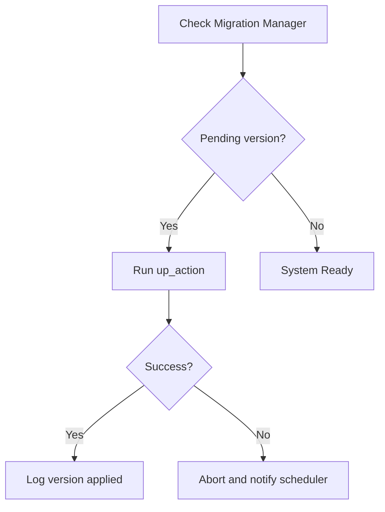

# Migration Framework Design

## Purpose

The HomeLab OS platform includes multiple persistent entities outside of the SQL database schema, such as YAML configuration parameters, Docker Compose project files, storage mount tables, and active plugin metadata. The Migration Framework provides a unified system to register and apply upgrades/downgrades across all these scopes.

## Scope

- Scopes migrations: `database`, `config`, `docker`, `plugin`, `storage`, `vault`.
- Registers versioned migration scripts chronologically.
- Tracks transition history to ensure correct application sequence.

## Migration Scopes

1. **`database`**: Governs Alembic and SQL relational databases.
2. **`config`**: Upgrades YAML structure (e.g. adding parameters).
3. **`docker`**: Rebuilds/adjusts container deployment patterns or files.
4. **`plugin`**: Adjusts plugin permission scopes or metadata blocks.
5. **`storage`**: Coordinates storage layouts or mount points on disk.
6. **`vault`**: Upgrades key-derivation algorithms or vault structures.

## Execution Sequence

