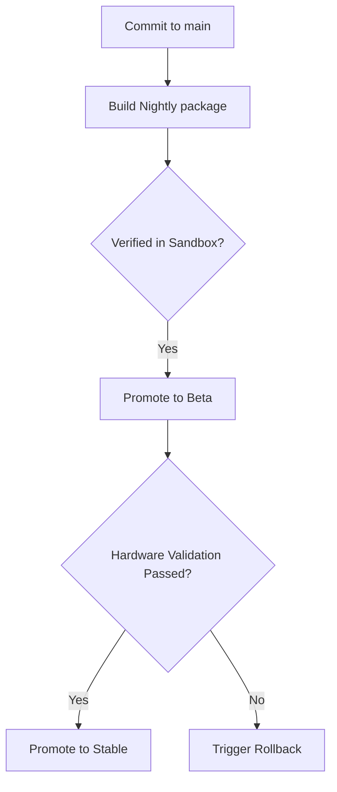

# Release Architecture Design

## Purpose

The Release Architecture defines the deployment flow, channel segregation, version validation, and upgrade/rollback protocols for HomeLab OS. This guarantees that developer features are correctly separated from production deployments on physical home server hardware.

## Scope

- Defines release channels: `stable`, `beta`, `nightly`.
- Establishes upgrade validation hooks.
- Defines rollback recovery procedures when automated updates fail.

## Release Lifecycle

## Upgrade and Rollback Guidelines

### 1. Pre-Upgrade Safeguard
Before applying an update, the system status is set to `UPDATING` via the [ServerStateMachine](file:///d:/Siddhant/projects/HomeLab%20OS/backend/app/core/server_state.py). This halts scheduled jobs in the [Scheduler](file:///d:/Siddhant/projects/HomeLab%20OS/backend/app/core/scheduler.py) and caches a configuration snapshot.

### 2. Migration Phase
The [MigrationManager](file:///d:/Siddhant/projects/HomeLab%20OS/backend/app/core/migration_manager.py) applies all outstanding migrations chronologically (database, configurations, Docker Compose updates).

### 3. Verification Post-Upgrade
The updater polls the system's `health` API for 5 minutes. If status becomes `healthy`, the state is returned to `RUNNING` and the backup config is archived.

### 4. Rollback Protocol
If system status remains `unhealthy` or fails to boot:
1. Revert database changes via Alembic downgrades.
2. Re-apply the cached configuration file.
3. Re-point Docker containers to their previous image tags.
4. Transition state machine status back to `RUNNING`.
