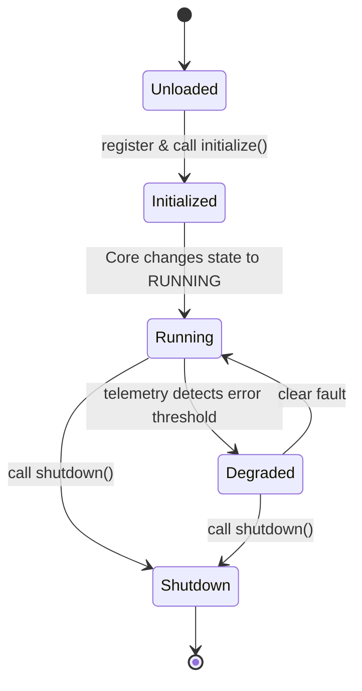

# Service Architecture Design

## Purpose

The Service Architecture enforces modular, unified lifecycle patterns and strict interface isolation across all major functional blocks of HomeLab OS. This replaces direct import dependencies and ad-hoc startup/shutdown sequences.

## Scope

- Defines `BaseService` abstraction interface.
- Standardizes service initialization, shutdown, and health checks.
- Establishes a concrete set of core platform service layers.

## Core Platform Services

The platform divides operations into 12 service packages:

1. **Authentication (`authentication`)**: Identity, credentials, API key management, JWT session token generation.
2. **Storage (`storage`)**: Physical disk management, partition maps, filesystem mount controls, ZFS/RAID layouts, and SMART status checks.
3. **Vault (`vault`)**: Encrypted keystores, LUKS container configuration, secrets orchestration, and master-key distribution.
4. **Monitoring (`monitoring`)**: Health daemon, performance counters, status log storage, and alert triggers.
5. **Automation (`automation`)**: Workflow trigger engine, device mappings, conditional rule evaluation.
6. **Scheduler (`scheduler`)**: Interval, cron, and calendar job executor.
7. **Notifications (`notifications`)**: Dispatch layer for push notifications, email, webhooks, or local message logs.
8. **Projects (`projects`)**: Git repository workspaces, configuration templates, directory structures.
9. **Workspace (`workspace`)**: Sandbox execution, Docker Compose environments, developer shell settings.
10. **Updates (`updates`)**: OTA updater, system image checksum checks, fallback staging, and container rebuild runs.
11. **Hardware (`hardware`)**: System integration via HAL to query physical board sensors.
12. **Plugins (`plugins`)**: Sandboxed extension discovery and execution interface.

## Service Lifecycle

## Base Class Definition

All services must inherit from [BaseService](file:///d:/Siddhant/projects/HomeLab%20OS/backend/app/core/base_service.py) and implement its abstract methods:
- `name`: unique identifier.
- `initialize()`: perform boot routines (e.g. database migrations, connection pools).
- `shutdown()`: safely release sockets, pools, and processes.
- `health()`: return structured service metrics and overall status label.
